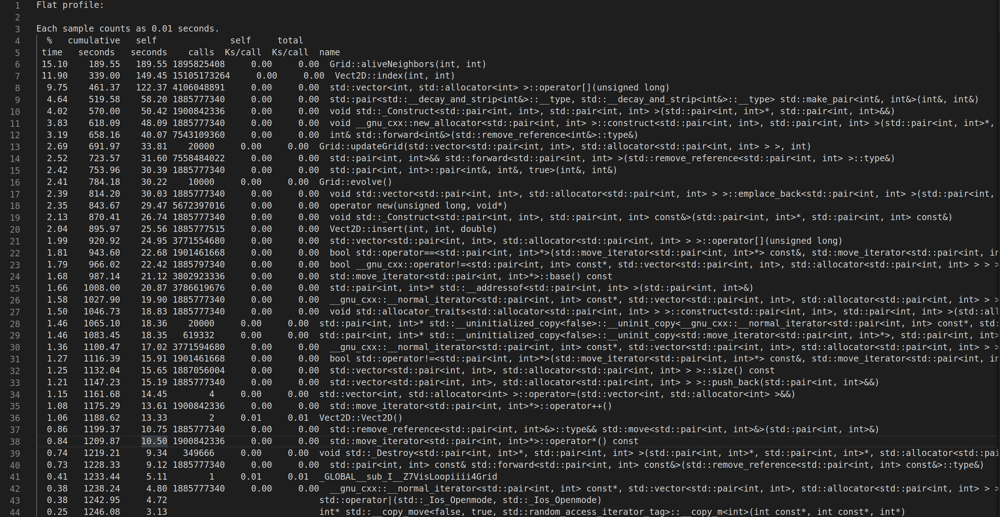

\newpage{}

# Introduction

Conway's Game of Life is a cellular automata used to study complex patterns that arise from a set of rules [3]. In this report I will explore how different methods for optimization and parallelization can be used to increase the efficiency of the computation used in this cellular automata. To begin with, a serial implementation will be completed and then run at different levels of compiler optimization, then followed by an parallelized implementation and an analysis of the difference between the two for the final report at the end of the semester.

# Conway's Game of Life

Cellular automata is a model used to simulate and study self-reproducing systems in an environment. This allows for many real world applications such as, the study of viral infection dynamics, lattice gas simulation and other dynamic systems in science, technology and mathematics. For this analysis, Conway's Game of Life will be used as the environment, which follows the following rules [5]:

* Any live call with fewer than 2 neighbors dies, underpopulated
* Any live cell with two or three live neighbors lives on to the next gen
* Any live cell with more than 3 live neighbors dies, overpopulation
* Any dead cell with exactly 3 live neighbors becomes living, reproduction

This version of the cellular automata is a zero-player game, which means the initial state of the simulation will determine how the evolution of everything within the environment will occur. The initial state normally contains common patterns, for example, oscillators, which are patterns that return to their initial state after a few generations or spaceships that fly across the grid[3]. Combining these simple initial state patterns is how you can get bigger more complex behaviors. Conway's Game of Life is also Turing complete meaning that it can be used to simulate a turning machine [4].

The key piece for this model is how the grid is represented, as this will change the efficiency of the model and how all the data can be processed. The most common way for the grid to be created is using a 2D array, and having the bounds of the grid all count as dead cells. Doing the simulation this way will lead to memory issues with bigger simulations and also inaccuracy of some patterns, as hitting the side of the grid will just kill off some cells. But the pattern will still run, just with a different behavior than what its original initial state would of given it. In theory, the patterns should be infinite, so the grid should be wrapped around allowing cells to continue at the opposite end of the grid when a border is hit, so when studying the behavior of the patterns alone, this functionality of the grid should be added for the most accuracy[2].

# Algorithm and current Serial Implementation
For this project the Game of Life was constructed in a way that would allow for ease of implementation but still provide the correct results. Since the point of this project is analyse the difference between serial vs parallel implementations of a program rather then analysis of the patterns behaviors, the grid did not have to allow for infinite patterns. This allowed for the grid to be implemented in the most common way of having all the cells outside the defined grid classified as dead. For the grids implementation of the area within, a conventional 2D array was not used, instead a 1D C++ vector was used to simulated a 2D array, this allowed for faster indexing then what a 2D implementation allows, thereby increasing the efficiency of the program. Currently the implementation for checking neighbors is done by indexing around a particular cell and a loop iteration, which has lead to a lot of if statements within the aliveNeighbors function. This was done in the interest of ease for the first implementation and is an ideal place for improvement for the final demonstration. The current change that is being proposed is to change it to a form of iteration around a point using mod arithmetic or using a convolve method with a Game of Life kernel which is 3*3 and all 1's with a 0 as the center point.

# Verification
To do verification for the Game of Life, simple known patterns had to be used so that the behaviors could be observed. This lead to the creation of the displayGoL.py script in the Serial/ file within the project. displayGoL.py is a script that will take commandline arguments and pass them to ./main to be run, and if the command Vis is passed then a visualization of the patterns behavior will occur. Using this created tool, I was able to compare simple patterns such a glider, block, blinker and glider gun to known working implementations of GoL, like "Golly", that is found on the ConwayLife.com website. Using the same patterns as what I did on my own implementation and comparing their behaviors, it was found that my implementation does in fact work with the GoL rules/environment. The only difference was when a boundary is hit, the behavior diverges from that of a infinite grid, and as discussed above, this is fine for this projects use case of the environment.

# Results of Milestone 1 Serial Implementation

## Data Results

> The following data will use these abbreviations to save space:
> * Gosper_glider_gun(Gospe)
> * Period144Oscillator(Perio)
> * Frothing_puffer(Froth) 
> * 13enginecordership(13eng)

## Profiling Results

> Below is a screenshot of the top of my profile results showing potential      areas for optimization

> This is the legend given by the profiling tool gprof and all the below key is from their output:

* % time: The percentage of the total running time of the program used by this       function.
* cumulative seconds: A running sum of the number of seconds accounted for by this        function and those listed above it.
* self seconds: The number of seconds accounted for by this function alone. This is       the major sort for this listing.
* calls: The number of times this function was invoked, if this function is profiled,     else blank.
* self ms/call: The average number of milliseconds spent in this function per call,       if this function is profiled, else blank.
    total ms/call: The average number of milliseconds spent in this function and  its descendants per call, if this function is profiled, else blank.
* name: The name of the function.  This is the minor sort for this listing. The         index shows the location of the function in the gprof listing. If the index is in parentheses it shows where it would appear in the gprof listing if it were   to be printed.

## Results Discussion

### Data Analysis

From the graphs above the effects of compiler optimization, grid size and pattern size on the program can be seen very clearly. This data was gathered by taking the average of 4 different executions, each time for each pattern, grid size, optimization level and amount of generations. The 4 patterns used from smallest to largest were Gosper_glider_gun(Gospe), Period144Oscillator(Perio), Frothing_puffer(Froth), 13enginecordership(13eng). From the results gathered, the standard deviation was also taken and used within an error bar on all the graphs, depicting that every test had similar results with the exception of "Gospe 1024^2" in the levelTwo/10000 graph. Even with this one anomaly, the average for all those executions was still inline with the trend of the rest of the of the data. 

#### No optimization

In the graphs with no optimization it can be seen that the amount of generations that the environment simulates will dramatically increase the runtime of the simulation. Just going from 1000 to 10000 generations took the simulation around 10 times longer to complete. The results found also suggest that the grid size also dramatically affects runtime of the program, as for each time the grid size parameter was doubled, the runtime was increase by approximately 3.5 times. From this the findings do suggest that the size of the pattern does not actually matter to the runtime of the program, since all the patterns finished around the same time and runtime was only ever increased with an increase of grid size or generations ran.

#### Compiler Optimization

With compiler optimization the run times of the program decrease by a factor of about 7 in every case. Between the 3 levels of compiler optimization that g++ allows, there was not much improvement and for the case of level two compile optimization, it got slightly worse then its level one counter part. Even with the optimizations, there was still was a huge jump in runtimes every time the grid size was doubled. In the optimization tests, pattern size still made no difference to the overall average time of an execution. But these findings do prove that having some form of compiler optimization will make the runtime of the Game of Life simulation faster.

### Profiling Analysis

Output from gprof shows that there was 2 calls that took up the most time while the program was running, these where Grid::aliveNeighbors and Vector2D::index. To get these findings, gprof was run using the Frothing_puffer pattern on a 1024^2 grid for 10000 generations. The time that the program was hung on these function calls was far more significant then any other call, leading me to believe there could be some optimization done on these functions, that isn't just done by the compiler. For Vector2D::index, the function could be sped up by changing the underlying implementation from using a vector<int> to a normal array of size = width*height. This will allow for faster lookups in memory, since everything in an array is next to each other, rather then being spread out like a vector<int> [1]. In the case of Grid::aliveNeighbors, I could clean up the function so it had less control flow, this would allow for variable initialization saving memory on each iteration. This could be done by making a convolve method that uses a game of life kernel to check the neighbors of the cell in question. Doing this would be far less beneficial as it wouldn't save to much memory and may introduce more bugs, making the program not valid. Since Grid::aliveNeighbors is a main component of the simulation, it is expected to be the most run function anyway.

\newpage{}

# References

[1]	cplusplus.com. "C library." https://www.cplusplus.com/reference/clibrary/ (accessed27/8, 2020).

[2]	S. W. Gadi Oxman, Yair Be’ery, " Computational methods for Conway's Game of Life cellular automaton," Computational methods for Conway's Game of Life cellular automaton, vol. 5, pp. 24-31.

[3]	R. F. Grove, " Cellular automata," Access Science, 2020.

[4]	P. Rendell, Turing Machine Universality of the Game of Life, 1 ed. 2016.

[5]	E. W. Weisstein. "Game of Life." Wolfram. https://mathworld.wolfram.com/GameofLife.html (accessed 27/8, 2020).